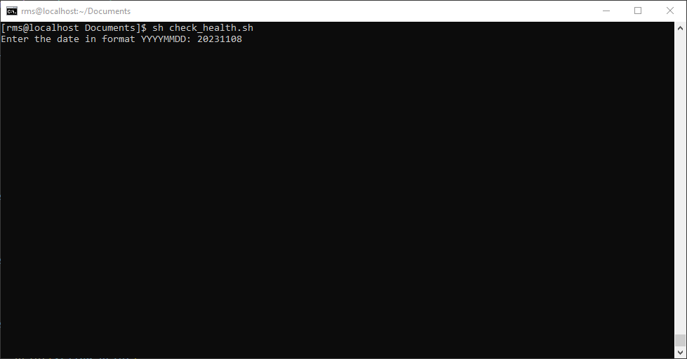
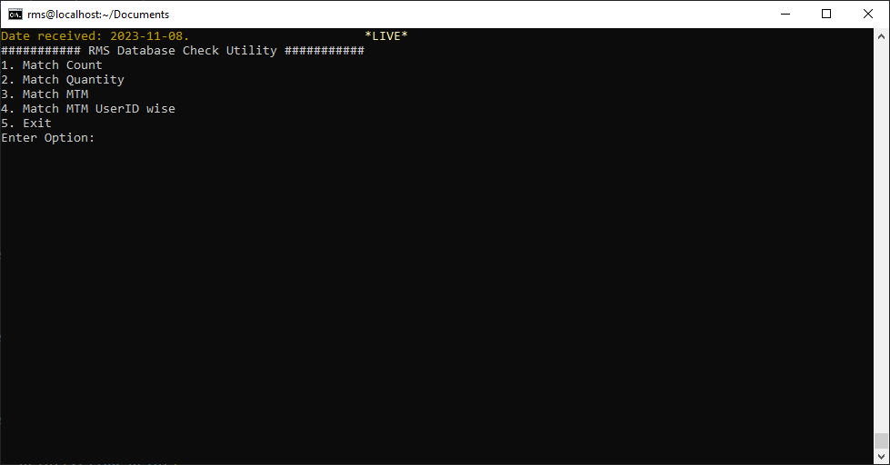
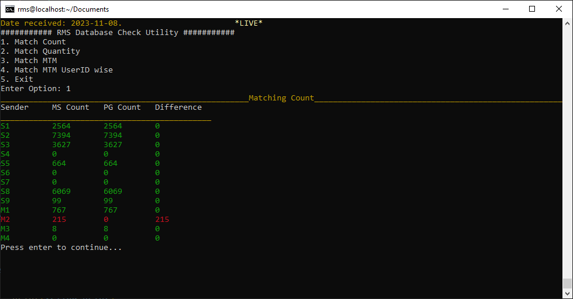
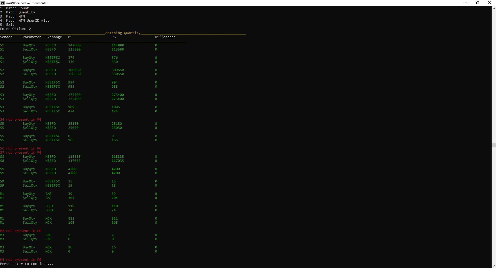
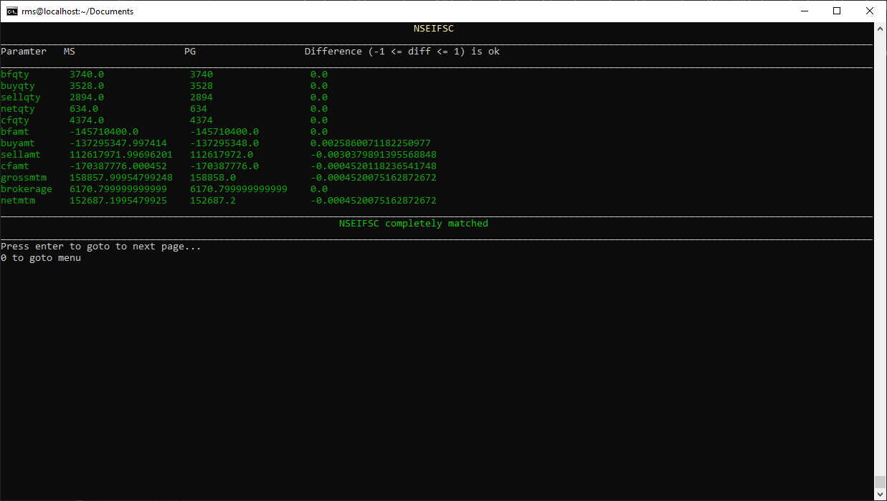
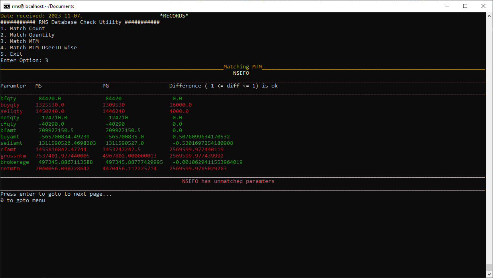
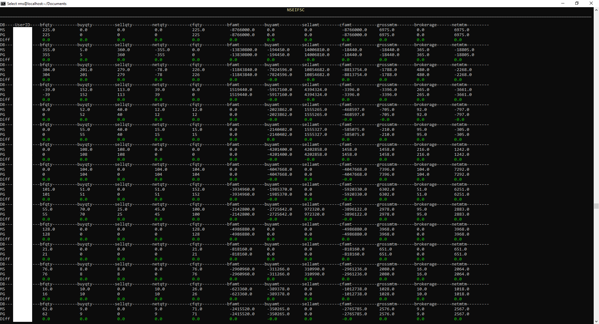
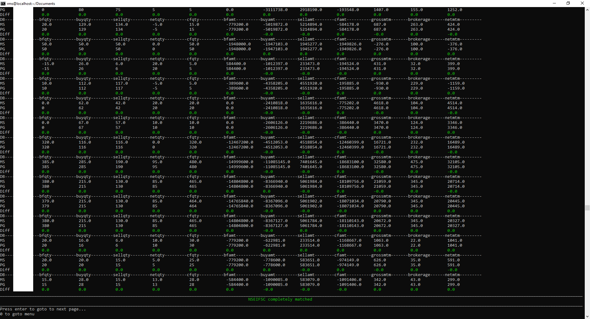
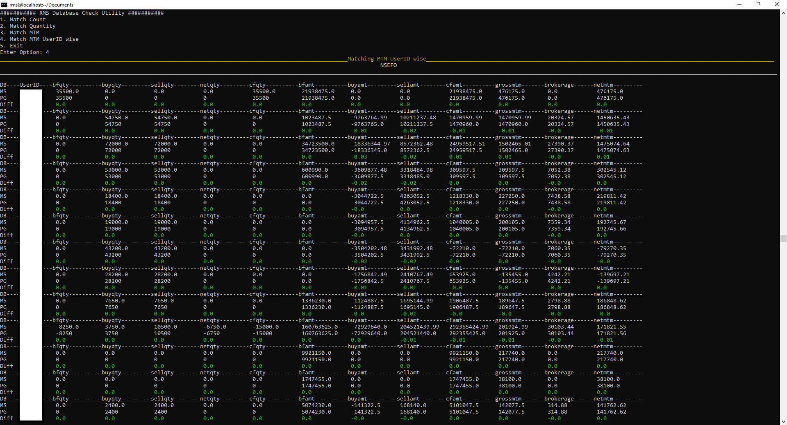
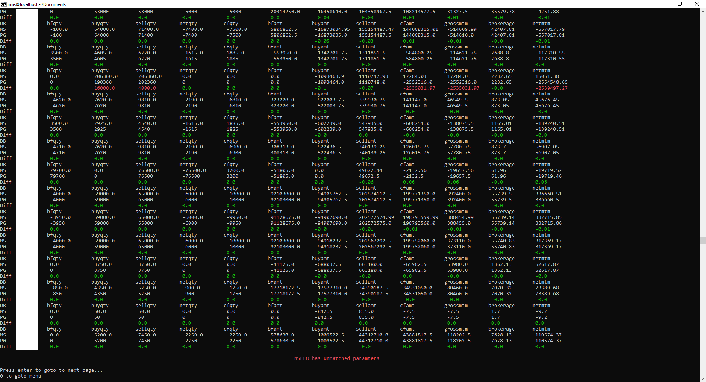

# DB-check-utility
RMS database health check CLI utility

## Overview

RMS Database Check Utility is a command-line tool designed to validate database consistency, integrity, and performance. It automates routine database health checks, helping developers and database administrators identify and resolve potential issues before they affect application performance.

Features

* Schema Validation: Ensures database schema matches expected structure.

* Data Consistency Checks: Detects missing or duplicate records.

* Index Analysis: Identifies missing or inefficient indexes.

* Query Performance Monitoring: Detects slow queries affecting database performance.

* Automated Reports: Generates detailed logs and reports for further analysis.

* Match Trade Data: Compares trade records across multiple databases to verify consistency.

* MTM and Quantity Matching: Validates trade quantities and mark-to-market values.

* User-wise Matching: Compares user-wise financial records for discrepancies.
### Screenshots of outputs
1) Entering date for which to match trades

2) Utility menu options page

3) Match Count option

4) Match Quantity option

5) Matching Mark to Market (MTM) - When it is matched

6) Matching Mark to Market (MTM) - When it is unmatched

7) Matching Mark to Market (MTM) for a userid (omitted userid) - When it is matched

8) Matching Mark to Market (MTM) for a userid (omitted userid) - When it is unmatched

